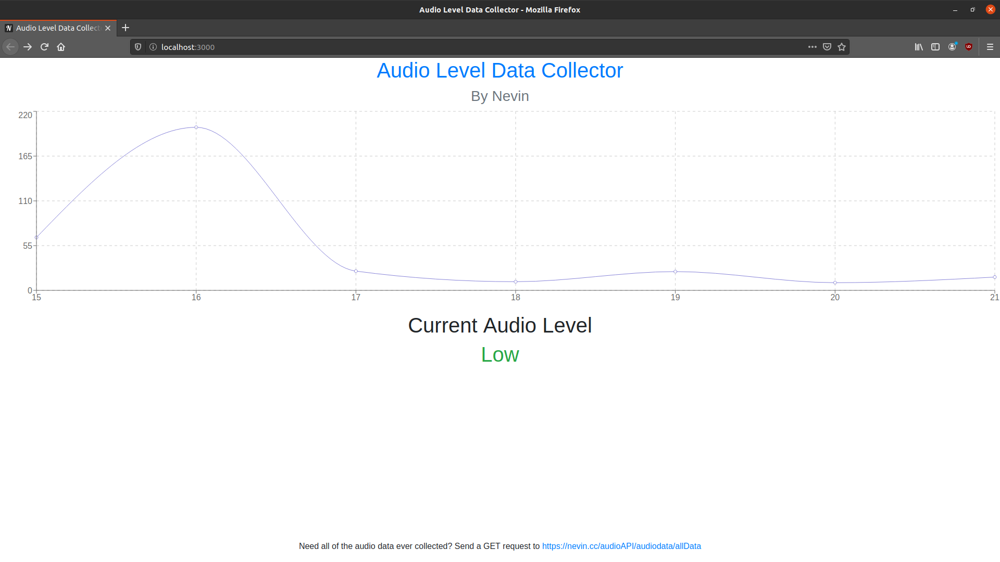

# Audio-Level-Data-Collector

A simple audio level data collector which uses python for the client, react js with rechart for the website, and express for the backend.

## Use

This is mainly a simple way to collect the audio levels in an area, and have it graphed. The actual set up you need to do is very simple, and the client can run on a very low power computer, like a rasberry pi.

## Client

To set up the client, drag the client folder somewhere on your computer. Then, make a script in /etc/cron.hourly which will run the python script in the client. After it is configured, the python script should automatically collect data every hour and upload it to the server. Please note, you will need to change my server URL to your server URL in both the client and python script if you want it to work properly.

## Server

Just node the server and make the python script point to where it is being hosted. One thing to note, if you are running the server on a domain with ssl, you will need to put your ssl keys in the folder which the server is in. If you don't plan on running the server on a domain with ssl, then just remove the https createserver lines and replace it with app.listen(port)

## Website

For the website, you need to change some things to make it work with your server, (more specifically, where the GET requests are sent to), but after that, just run NPM build and it should work.
